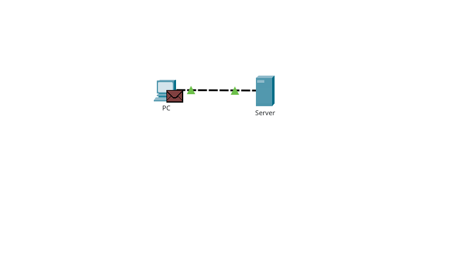
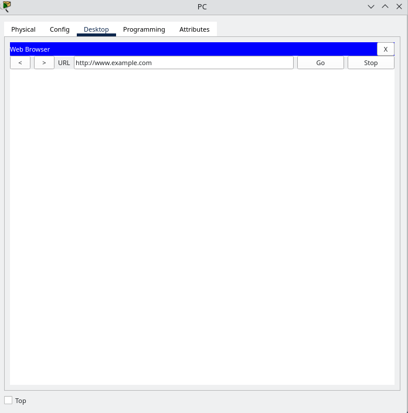
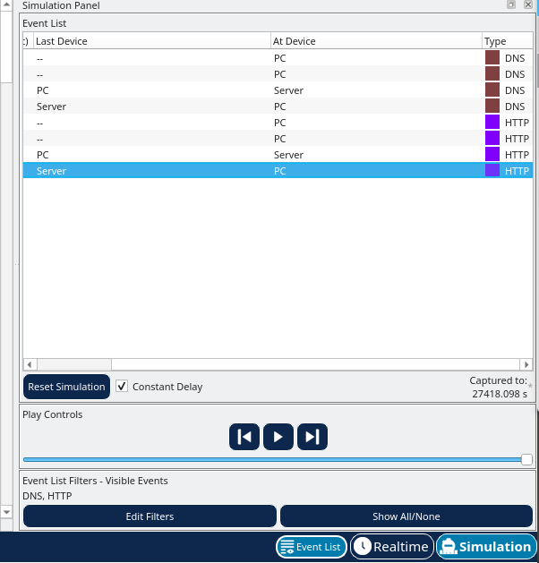
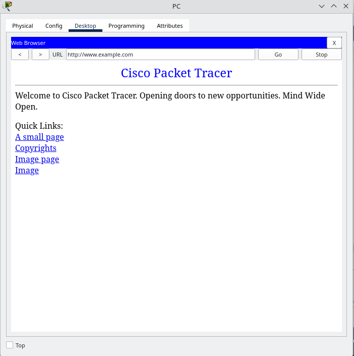

# The Client Interaction

## Overview
    A simple network consisting of a PC connected directly to a server configured to supply DNS services as well as hosting a web page through a HTTP server.

## Objectives
    Observer the client interaction between the server and PC.

## Topology
    Describe the devices used:
        One PC connecting to a Server
        

## Configuration Summary
    In simulation mode, under "Edit Filters", and under the IPv4 tab, only DNS is selected. Under the Misc tab, only HTTP is selected.

    In Desktop tab, a simulated web browser opens and "www.example.com" is typed into it.
        

    Running the simulation:
        After pressing Play Controls, the Event List shows the exchange between the PC and the server. These events represent the PC's request to resolve the URL to an IP address, the server's providing of the IP address, the PC's request for the web page, and the server's sending the web page in two segments, and the PC's acknowledging the web page.
            

        In the simulated web browser, there is a web page displayed on it.
            
