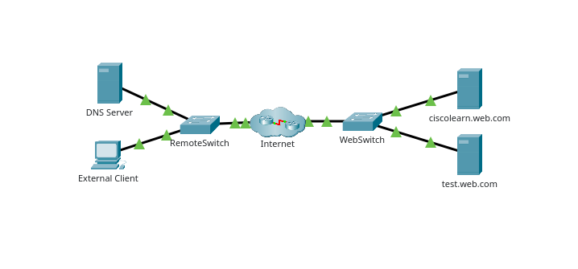
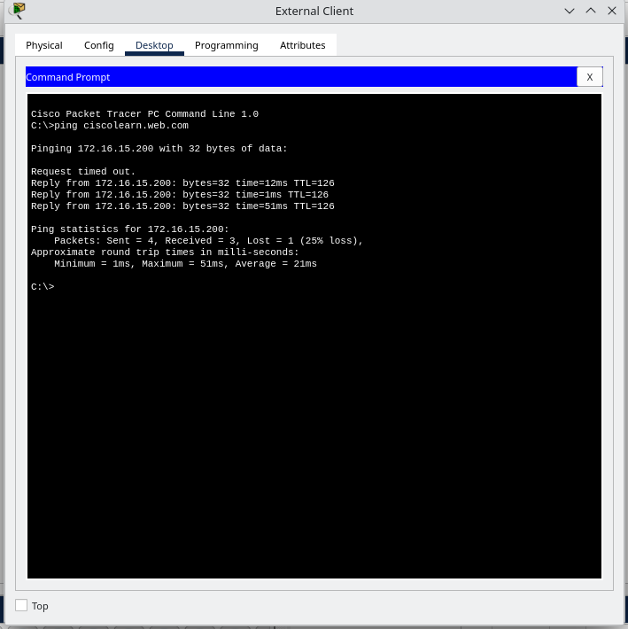
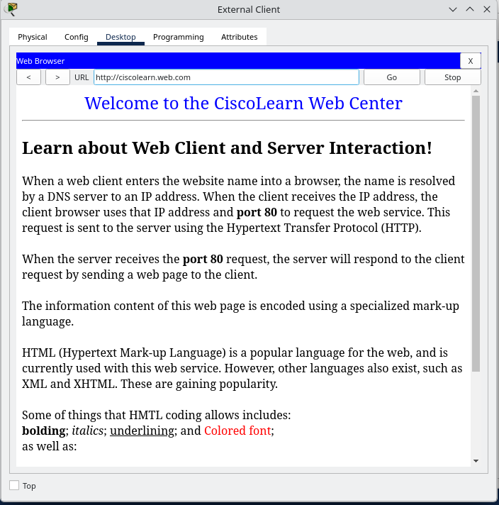
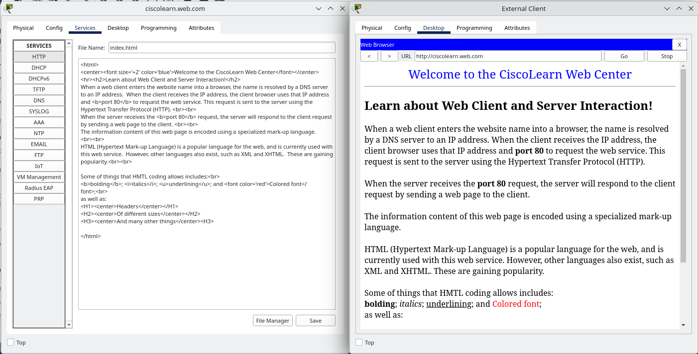
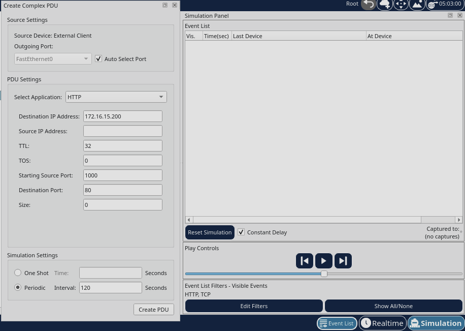
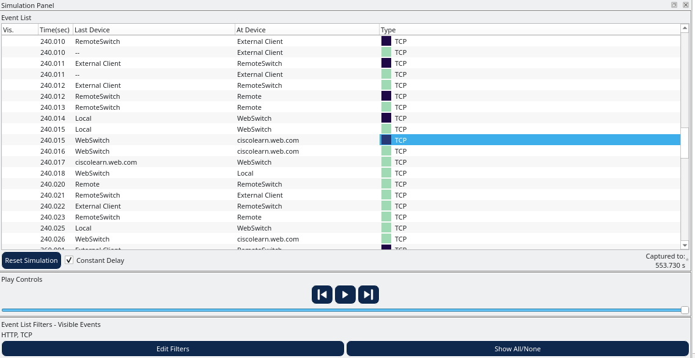

# Packet Tracer - Observer Web Requests

## Objectives
To view the client/server traffic sent from a PC to a web server when requesting web services.

## Topology
Describe the devices used:
- One PC
- 2 switches
- 3 servers

        DNS Server
        test.web.com
        ciscolearn.web.com

## Configuration Summary
The PC (External Client) will access the Command Prompt from the Desktop tab to ping the URL ciscolearn.web.com.

Connecting to the web server through the Destop window, to access the Web Browser. The URL is ciscolearn.web.com.

On the ciscolearn.web.com server Services tab, clicked on HTTP tab to open the index.html file.

In the Simulation Panel, the filters are changed to only TCP and HTTP protocols. Next, Complex PDU was created. The destination IP address of ciscolearn.web.com is 172.16.15.200. The starting port is set to 1000, as shown in the image below.

## Verification
The simulation captured the packages sent between the External Client and ciscolearn.web.com server.

