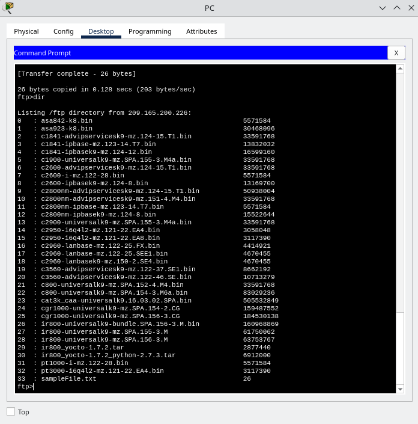
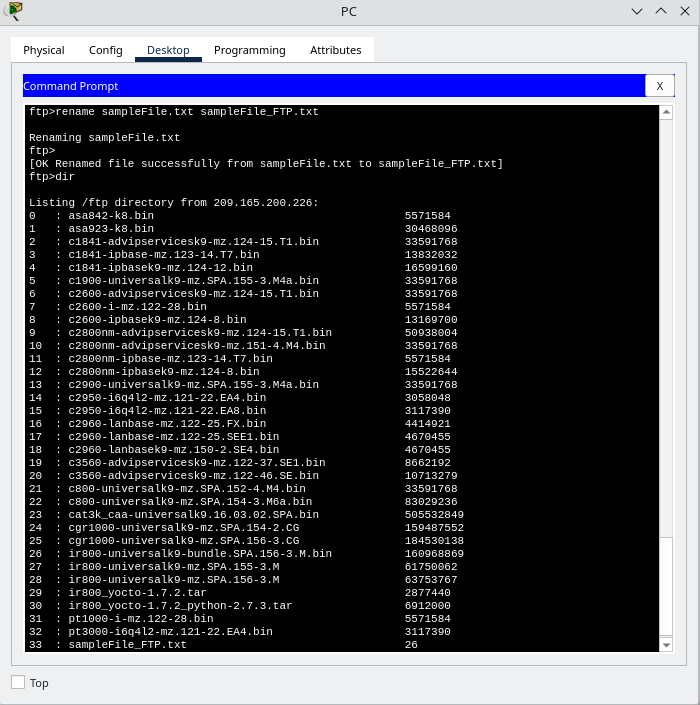

### Packet Tracer - Use FTP Services

## Overview
    The server is configured to run the service where clients connect, login, and transfer files. FTP uses port 21 as the server where clients connect, login, and transfer files. FTP uses port 21 as the server command port to create the connection. FTP then uses port 20 for data transfer.
        TFP Server (ftp.pka) - Interface (NIC)
        IP Address           - 209.165.200.226
        Subnet Mask          - 255.255.255.244

## Objectives
    Upload a file to an FTP server
    Download a file from an FTP server

## Topology
    Describe the devices used:
        One PC
        One Router
        FTP Server (ftp.pka)
        

## Configuration Summary
    Step 1:
        The Command Prompt (under Desktop tab), '?' was entered into the command to list the available commands. Later 'dir' command is entered in the prompt to see the files on the PC. It is observed that there is a "sampleFile.txt" file in the C:\directory.

            
                The output of the command 'dir':
                    C:\> dir
                    Volume in drive C has no label
                    Volume Serial Number is 5E12-4AF3
                    Directory of C:\
                    12/31/1969 17:0 PM 26 sampleFile.txt
                    26 bytes 1 File(s)

    Step 2:
        Connecting to the FTP server at 209.165.200.226 (or with its DNS ftp.pka).
            The output of the command is as follow:
                C:\> ftp 209.165.200.226
                    Trying to connect...209.165.200.226
                    Connected to 209.165.200.226

        Connection successful. Entering username 'student' and password 'class' to gain access.
            220- Welcome to PT Ftp server
                Username:student
                331- Username ok, need password
                Password:
                230- Logged in
                (passive mode On)

    Step 3: Uploading a file to the FTP Server
        Enter '?' command in the prompt to list the commands available in the ftp client and 'dir' to see the files available on the server.

        Enter 'put sampleFile.txt' to send the file to the server
            Below are the output:
                ftp>put sampleFile.txt
                Writing file sampleFile.txt to 209.165.200.226:
                File transfer in progress...
                [Transfer complete - 26 bytes]
                26 bytes copied in 0.128 secs (203 bytes/sec)

        Enter 'dir' again in the prompt to list the contents of the FTP server and verified that the file has been uploaded to the FTP server, as shown in the image below.
            

        Part 4: Download a file from the FTP server
            First, rename the file 'sampleFile.txt' and download it from the FTP server.

                To rename the file, in the prompt enter 'rename sampleFile.txt sampleFile_FTP.txt'
                    Below are the image and the output of the prompt:
                        ftp>rename sampleFile.txt sampleFile_FTP.txt
                        Renaming sampleFile.txt
                        ftp>
                        [OK Renamed file successfully from sampleFile.txt to sampleFile_FTP.txt]
                        ftp>dir

                        

                Enter 'dir' again at the prompt and the file renamed has been verified.

            To download the file, enter the command 'get sampleFile_FTP.txt' to retrieve the file from the server.
                Below are the image and the output of the prompt:
                    ftp>get sampleFile_FTP.txt
                    Reading file sampleFile_FTP.txt from 209.165.200.226:
                    File transfer in progress...
                    [Transfer complete - 26 bytes]
                    26 bytes copied in 0 secs

            In the

## Verification

