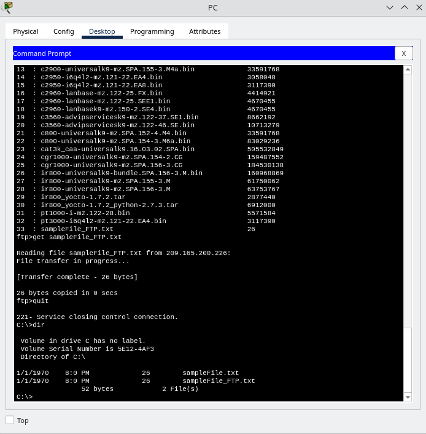
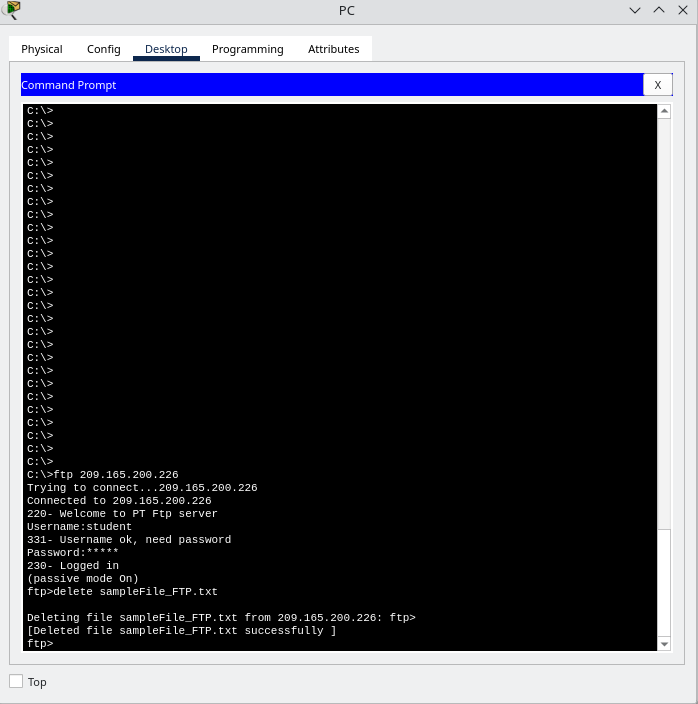

# Packet Tracer - Use FTP Services
## Overview
The server is configured to run the service where clients connect, login, and transfer files. FTP uses port 21 as the server where clients connect, login, and transfer files. FTP uses port 21 as the server command port to create the connection. FTP then uses port 20 for data transfer.

|TFP Server (ftp.pka) | Interface (NIC)|
|---------------------|----------------|
|IP Address | 209.165.200.226 |
|Subnet Mask | 255.255.255.244 |

## Objectives
- Upload a file to an FTP server
- Download a file from an FTP server

## Topology
 Describe the devices used:
- One PC
- One Router
- FTP Server (ftp.pka)

## Configuration Summary
### Step 1:
The Command Prompt (under Desktop tab), '?' was entered into the command to list the available commands. Later 'dir' command is entered in the prompt to see the files on the PC. It is observed that there is a "sampleFile.txt" file in the C:\directory.

    The output of the command 'dir':
    C:\> dir
    Volume in drive C has no label
    Volume Serial Number is 5E12-4AF3
    Directory of C:\
    12/31/1969 17:0 PM 26 sampleFile.txt
    26 bytes 1 File(s)

### Step 2: Connect to the server
Connecting to the FTP server at 209.165.200.226 (or with its DNS ftp.pka).

    The output of the command is as follow:
        C:\> ftp 209.165.200.226
            Trying to connect...209.165.200.226
            Connected to 209.165.200.226

        Connection successful. Entering username 'student' and password 'class' to gain access.
            220- Welcome to PT Ftp server
                Username:student
                331- Username ok, need password
                Password:
                230- Logged in
                (passive mode On)

### Step 3: Uploading a file to the FTP Server
Enter '?' command in the prompt to list the commands available in the ftp client and 'dir' to see the files available on the server.

Enter 'put sampleFile.txt' to send the file to the server. Below are the output:

    ftp>put sampleFile.txt
    Writing file sampleFile.txt to 209.165.200.226:
    File transfer in progress...
    [Transfer complete - 26 bytes]
    26 bytes copied in 0.128 secs (203 bytes/sec)

Enter 'dir' again in the prompt to list the contents of the FTP server and verified that the file has been uploaded to the FTP server, as shown in the image below.

### Step 4: Download a file from the FTP server
First, rename the file 'sampleFile.txt' and download it from the FTP server.

To rename the file, in the prompt enter 'rename sampleFile.txt sampleFile_FTP.txt'

 Below are the image and the output of the prompt:

    ftp>rename sampleFile.txt sampleFile_FTP.txt
    Renaming sampleFile.txt
    ftp>
    [OK Renamed file successfully from sampleFile.txt to sampleFile_FTP.txt]
    ftp>dir

Enter 'dir' again at the prompt and the file renamed has been verified.

To download the file, enter the command 'get sampleFile_FTP.txt' to retrieve the file from the server. Below are the image and the output of the prompt:

    ftp>get sampleFile_FTP.txt
    Reading file sampleFile_FTP.txt from 209.165.200.226:
    File transfer in progress...
    [Transfer complete - 26 bytes]
    26 bytes copied in 0 secs

In the prompt enter 'dir' again to verify the FTP file has been downloaded. Below are the image and the output:

    C:\>dir
    Volume in drive C has no label.
    Volume Serial Number is 5E12-4AF3
    Directory of C:\
    1/1/1970    8:0 PM             26        sampleFile.txt
    1/1/1970    8:0 PM             26        sampleFile_FTP.txt
                    52 bytes            2 File(s)

### Step 5:
Login in the FTP server again to delete the 'sampleFile_FTP.txt'.

To delete the file, enter the command 'delete sampleFile_FTP.txt'. Below are the image and output:

    C:\>ftp 209.165.200.226
    Trying to connect...209.165.200.226
    Connected to 209.165.200.226
    220- Welcome to PT Ftp server
    Username:student
    331- Username ok, need password
    Password:*****
    230- Logged in
    (passive mode On)
    ftp>delete sampleFile_FTP.txt
    Deleting file sampleFile_FTP.txt from 209.165.200.226: ftp>
    [Deleted file sampleFile_FTP.txt successfully ]

Enter the command 'dir' again to verify the file is deleted. Below is the output:

    ftp>dir
    Listing /ftp directory from 209.165.200.226:
    0   : asa842-k8.bin                                      5571584
    1   : asa923-k8.bin                                      30468096
    2   : c1841-advipservicesk9-mz.124-15.T1.bin             33591768
    3   : c1841-ipbase-mz.123-14.T7.bin                      13832032
    4   : c1841-ipbasek9-mz.124-1S2.bin                       16599160
    5   : c1900-universalk9-mz.SPA.155-3.M4a.bin             33591768
    6   : c2600-advipservicesk9-mz.124-15.T1.bin             33591768
    7   : c2600-i-mz.122-28.bin                              5571584
    8   : c2600-ipbasek9-mz.124-8.bin                        13169700
    9   : c2800nm-advipservicesk9-mz.124-15.T1.bin           50938004
    10  : c2800nm-advipservicesk9-mz.151-4.M4.bin            33591768
    11  : c2800nm-ipbase-mz.123-14.T7.bin                    5571584
    12  : c2800nm-ipbasek9-mz.124-8.bin                      15522644
    13  : c2900-universalk9-mz.SPA.155-3.M4a.bin             33591768
    14  : c2950-i6q4l2-mz.121-22.EA4.bin                     3058048
    15  : c2950-i6q4l2-mz.121-22.EA8.bin                     3117390
    16  : c2960-lanbase-mz.122-25.FX.bin                     4414921
    17  : c2960-lanbase-mz.122-25.SEE1.bin                   4670455
    18  : c2960-lanbasek9-mz.150-2.SE4.bin                   4670455
    19  : c3560-advipservicesk9-mz.122-37.SE1.bin            8662192
    20  : c3560-advipservicesk9-mz.122-46.SE.bin             10713279
    21  : c800-universalk9-mz.SPA.152-4.M4.bin               33591768
    22  : c800-universalk9-mz.SPA.154-3.M6a.bin              83029236
    23  : cat3k_caa-universalk9.16.03.02.SPA.bin             505532849
    24  : cgr1000-universalk9-mz.SPA.154-2.CG                159487552
    25  : cgr1000-universalk9-mz.SPA.156-3.CG                184530138
    26  : ir800-universalk9-bundle.SPA.156-3.M.bin           160968869
    27  : ir800-universalk9-mz.SPA.155-3.M                   61750062
    28  : ir800-universalk9-mz.SPA.156-3.M                   63753767
    29  : ir800_yocto-1.7.2.tar                              2877440
    30  : ir800_yocto-1.7.2_python-2.7.3.tar                 6912000
    31  : pt1000-i-mz.122-28.bin                             5571584
    32  : pt3000-i6q4l2-mz.121-22.EA4.bin                    3117390

